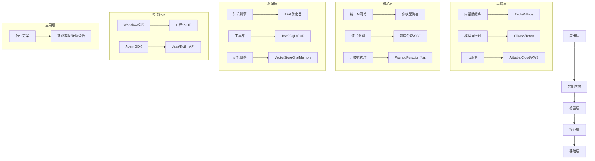
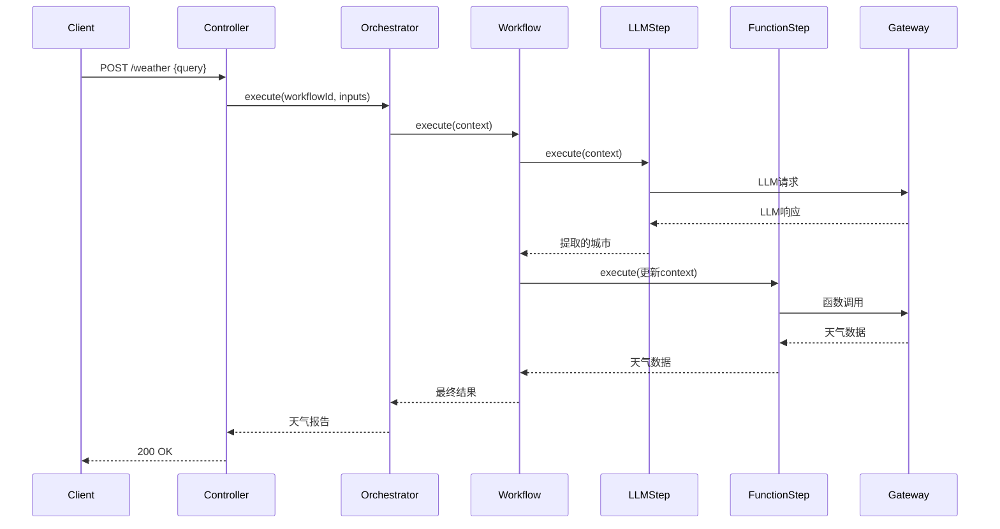

# NeuroFlow 框架文档

## 概述

NeuroFlow 是一个为 Java 开发者设计的现代化 AI 开发框架，集成了大型语言模型（LLM）能力和自定义 AI 函数，简化了 AI 应用的开发流程。它提供了：

- **统一 AI 网关**：集成多种 AI 模型（OpenAI, Qwen, Ollama 等）
- **函数编排引擎**：通过注解注册 AI 函数
- **工作流系统**：可视化编排复杂 AI 任务
- **企业级特性**：可观测性、安全合规、性能优化

## 核心特性

1. **多模型支持**：统一接入 OpenAI, Qwen, Ollama 等模型
2. **函数即服务**：通过注解注册 Java 方法为 AI 可调用函数
3. **工作流引擎**：可视化或代码方式编排复杂 AI 任务
4. **性能优化**：自适应 Token 管理、多模型熔断
5. **企业级扩展**：安全过滤、内容审计、混合部署

## 快速开始

### 添加依赖

```xml
<dependency>
    <groupId>io.neuroflow</groupId>
    <artifactId>neuroflow-spring-boot-starter</artifactId>
    <version>1.0.0</version>
</dependency>
```

### 基础配置 (application.yml)

```yaml
neuroflow:
  gateway:
    models:
      openai:
        api-key: ${OPENAI_API_KEY}
      qwen:
        api-key: ${QWEN_API_KEY}
    model-priority: 
      - openai
      - qwen
  agent:
    enabled: true
```

### 启用框架

```java
@SpringBootApplication
@EnableNeuroFlow
public class Application {
    public static void main(String[] args) {
        SpringApplication.run(Application.class, args);
    }
}
```

## 开发示例

### 定义 AI 函数

```java
@Service
public class WeatherService {

    @AIFunction(name = "get_weather", 
               description = "获取城市天气信息",
               timeout = 3000)
    public WeatherData getWeather(
        @Param(name = "city", description = "城市名称") String city,
        @DefaultValue("metric") @Param(name = "unit", description = "温度单位") String unit) {
        
        // 调用真实天气 API
        return weatherAPI.fetch(city, unit);
    }
}
```

### 创建工作流

```java
@Configuration
public class WorkflowConfig {

    @Bean
    public Workflow weatherWorkflow(NeuroFlowGateway gateway, FunctionRegistry registry) {
        return DSL.workflow("weather-report", gateway)
            .llmStep("extract_city", "从文本提取城市: {{input}}", "gpt-3.5-turbo")
            .functionStep("fetch_weather", "get_weather", registry)
            .llmStep("generate_response", "生成天气报告: {{fetch_weather.output}}", "gpt-4")
            .build();
    }
}
```

### 调用工作流

```java
@RestController
@RequestMapping("/weather")
public class WeatherController {

    @Autowired
    private AgentOrchestrator orchestrator;

    @PostMapping
    public Mono<String> getWeatherReport(@RequestBody String userQuery) {
        return orchestrator.execute("weather-report", Map.of("input", userQuery));
    }
}
```

## 最佳实践

### 1. 高效提示工程

```java
// 使用模板变量提高可维护性
String prompt = """
    你是一个专业的天气助手，请根据以下数据生成报告：
    城市: {{city}}
    温度: {{temp}}°C
    条件: {{condition}}
    
    要求：
    1. 使用友好的语气
    2. 包含穿衣建议
    3. 不超过100字
    """;
    
// 在步骤中解析模板
new LLMCallStep("weather_report", prompt, "gpt-4", gateway);
```

### 2. 复杂工作流编排

```java
// 带条件分支的工作流
Predicate<Map<String, Object>> rainCondition = context -> 
    ((WeatherData)context.get("weather")).isRaining();

Step rainAdvice = new LLMCallStep("rain_advice", "生成雨天建议", "gpt-3.5-turbo", gateway);
Step normalReport = new LLMCallStep("normal_report", "生成普通报告", "gpt-3.5-turbo", gateway);

Workflow workflow = DSL.workflow("smart-weather", gateway)
    .functionStep("get_weather", "get_weather", registry)
    .conditionalStep("check_rain", rainCondition, rainAdvice, normalReport)
    .llmStep("final_output", "结合{{rain_advice.output}}和{{normal_report.output}}生成最终报告", "gpt-4")
    .build();
```

### 3. 错误处理策略

```java
// 带错误回退的工作流
Step mainStep = new FunctionCallStep("fetch_data", "get_weather", registry, gateway);

Function<Throwable, Step> fallback = error -> 
    new LLMCallStep("fallback", "生成服务不可用的友好提示", "gpt-3.5-turbo", gateway);

Workflow workflow = DSL.workflow("reliable-weather", gateway)
    .step(new ErrorHandlingStep("weather_with_fallback", mainStep, fallback))
    .build();
```

### 4. 性能优化技巧

```yaml
# 配置多模型熔断
neuroflow:
  gateway:
    models:
      gpt4:
        api-key: ${GPT4_KEY}
        cost-factor: 2.0  # 成本因子
      qwen:
        api-key: ${QWEN_KEY}
        cost-factor: 0.8
    model-priority: 
      - qwen   # 优先使用低成本模型
      - gpt4   # 高优先级任务使用
    fallback-threshold: 0.7 # 准确率低于70%时切换模型
```

## 架构设计

### 核心架构图



### 工作流执行流程



## 注意事项

### 1. 安全性最佳实践

```yaml
# 启用安全过滤器
neuroflow:
  security:
    filters:
      - type: keyword
        keywords: [密码, 身份证号, 银行卡]
      - type: regex
        pattern: \b\d{4}[- ]?\d{4}[- ]?\d{4}\b # 信用卡号
```

### 2. 性能调优指南

1. **Token 优化**：
   ```java
   // 启用上下文压缩
   neuroflow:
     optimization:
       context-compression: true
       max-context-length: 4096
   ```
   
2. **批处理请求**：
   ```java
   // 在网关层启用批处理
   neuroflow:
     gateway:
       batching:
         enabled: true
         max-batch-size: 10
         timeout: 50 # ms
   ```

### 3. 可观测性配置

```java
@Configuration
@EnableAIObservability
public class ObservabilityConfig {
    
    @Bean
    public MeterRegistry meterRegistry() {
        return new PrometheusMeterRegistry(PrometheusConfig.DEFAULT);
    }
    
    @Bean
    public Tracer tracer() {
        return new OpenTelemetryTracer();
    }
}
```

### 4. 成本控制策略

1. **模型分级**：
   ```yaml
   neuroflow:
     cost-control:
       tiers:
         - model: gpt-4
           max-daily-cost: 100.0 # 美元
         - model: gpt-3.5-turbo
           max-daily-cost: 50.0
   ```
   
2. **使用限制**：
   ```java
   // 在函数上添加限流注解
   @AIFunction(name = "expensive_operation")
   @RateLimit(limit = 100, period = "1h") // 每小时最多100次调用
   public Result expensiveOperation() {
       // ...
   }
   ```

## 模块说明

| 模块           | 坐标                                         | 功能                 |
| -------------- | -------------------------------------------- | -------------------- |
| **Core**       | `io.neuroflow:neuroflow-core`                | 核心网关、模型路由   |
| **Starter**    | `io.neuroflow:neuroflow-spring-boot-starter` | Spring Boot 自动配置 |
| **Agent**      | `io.neuroflow:neuroflow-agent`               | 工作流编排引擎       |
| **Tools**      | `io.neuroflow:neuroflow-tools`               | Text2SQL/OCR 等工具  |
| **Alibaba**    | `io.neuroflow:neuroflow-alibaba`             | 阿里云模型扩展       |
| **Monitoring** | `io.neuroflow:neuroflow-monitoring`          | 可观测性集成         |

## 故障排查

### 常见问题及解决方案

1. **函数调用失败**：
   - 检查 `@AIFunction` 和 `@Param` 注解是否正确
   - 验证参数类型匹配（JSON 类型到 Java 类型）
   - 确保函数在 Spring 上下文中

2. **模型响应慢**：
   - 检查模型端点配置
   - 启用网关缓存：`neuroflow.gateway.cache.enabled=true`
   - 降低请求复杂度或使用更小模型

3. **工作流卡住**：
   - 检查步骤超时设置
   - 验证上下文数据传递
   - 启用工作流调试日志：`logging.level.io.neuroflow.agent=DEBUG`

## 未来路线图

1. **可视化工作流编辑器**：基于 Web 的拖拽式工作流设计器
2. **模型微调集成**：内置模型微调支持
3. **多模态扩展**：支持图像和音频处理
4. **边缘计算优化**：轻量级部署方案

## 贡献指南

我们欢迎贡献！请遵循以下步骤：

1. Fork 项目仓库
2. 创建特性分支 (`git checkout -b feature/AmazingFeature`)
3. 提交更改 (`git commit -m 'Add some AmazingFeature'`)
4. 推送到分支 (`git push origin feature/AmazingFeature`)
5. 打开 Pull Request

## 许可证

NeuroFlow 使用 Apache License 2.0 开源许可证。详情请查看 [LICENSE](LICENSE) 文件。

## 获取帮助

- [GitHub Issues](https://github.com/your-org/neuroflow/issues) - 报告问题或请求功能
- 社区论坛：forum.neuroflow.io
- 商业支持：support@neuroflow.io

---

NeuroFlow 框架为 Java 开发者提供了构建 AI 应用的强大工具集，结合了 Spring 生态的便利性和 AI 的最新能力。通过本指南，您可以快速开始构建智能应用并遵循最佳实践以确保性能和安全。